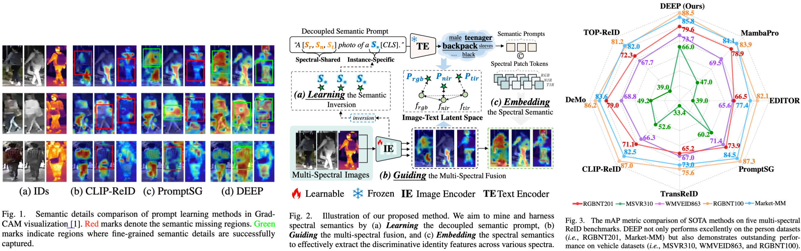
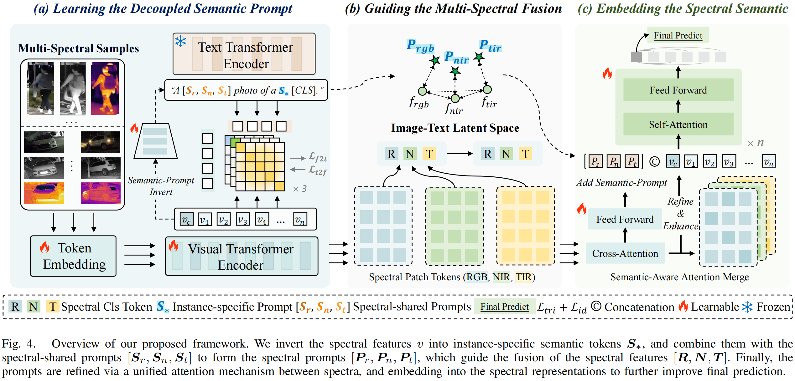
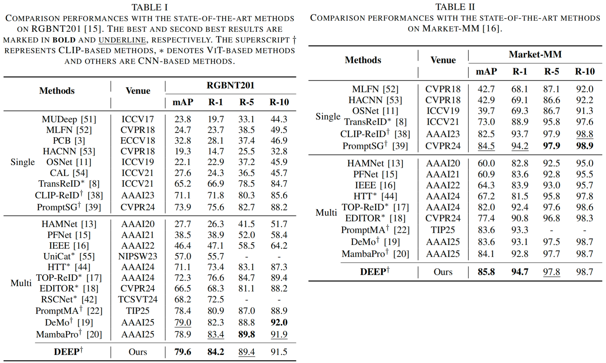
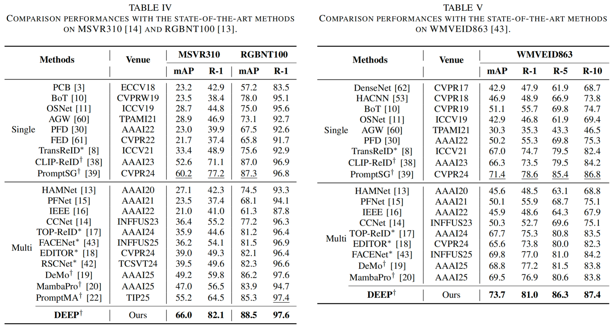
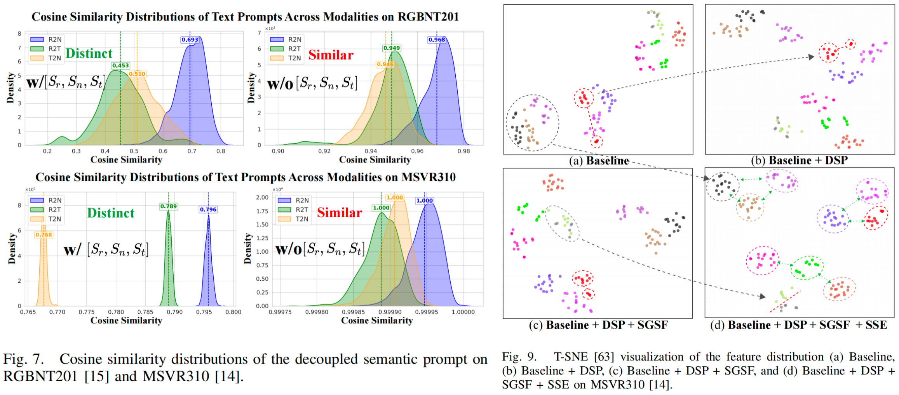
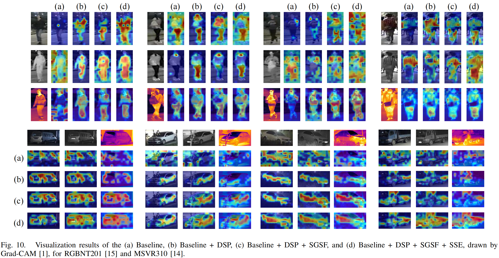
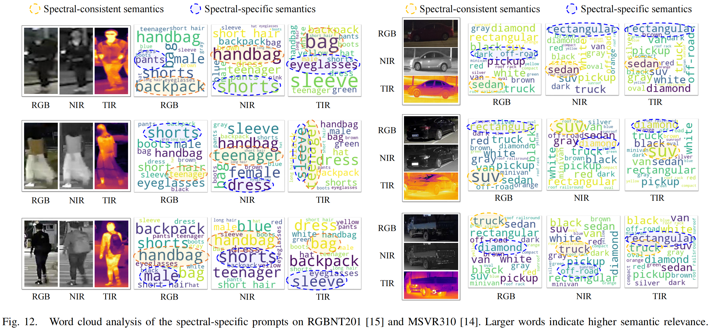

# DEEP: Decoupled Semantic Prompt Learning, Guiding and Embedding for Multi-Spectral Object Re-Identification

<!-- Authors: [Shihao Li], [Chenglong Li], [Aihua Zheng], [Jin Tang], [Bin Luo]. -->
Authors: [Shihao Li, Chenglong Li, Aihua Zheng*, Jin Tang, Bin Luo].

Accepcted by [IEEE Transactions on Multimedia], [2026]  
[[Paper]](https://ieeexplore.ieee.org/abstract/document/11370286) 

---

## 📌 Abstract

 <!-- optional -->

Multi-spectral object re-identification (ReID) captures diverse object semantics to robustly recognize identity in complex environments. 
However, without explicit semantic guidance (e.g., attributes, masks, and keypoints), existing modal fusion-based methods struggle to comprehensively capture person or vehicle semantics across spectra. 
Thanks to the large-scale vision-language pre-training, CLIP effectively aligns visual concepts across different image modalities to a unified semantic prompt. 
In this paper, we propose DEEP, a DEcoupled sEmantic Prompt Learning, Guiding and Embedding framework for Multi-Spectral Object ReID. 
Specifically, to address the challenges posed by low-quality modality noise and spectral style discrepancies, we first propose a Decoupled Semantic Prompt (DSP) strategy, which explicitly decouples the semantic alignment into spectral-style learning with spectral-shared prompts and object content learning with instance-specific inversion token. 
Second, to lead the model focusing on semantically faithful regions, we propose a Semantic-Guided Spectral Fusion (SGSF) module that builds a semantic interaction bridge between spectra to explore complementary semantics across modalities. 
Finally, to further empower the spectral representation, we propose a Spectral Semantic Embedding (SSE) module constrained by semantic-aware structural consistency to refine the fine-grained identity semantics in each spectrum. 
Extensive experiments on five public benchmarks, RGBNT201, Market-MM, MSVR310, WMVEID863, and RGBNT100, demonstrate the proposed method outperforms the state-of-the-art methods.

 <!-- optional -->
 <!-- optional -->
 <!-- optional -->



<!-- optional -->
 <!-- optional -->
 <!-- optional -->
---


### 📖 Citation

If you find our work helpful, please consider citing:

```
@article{li2026deep,
  author={Li, Shihao and Li, Chenglong and Zheng, Aihua and Tang, Jin and Luo, Bin},
  journal={IEEE Transactions on Multimedia}, 
  title={DEEP: Decoupled Semantic Prompt Learning, Guiding and Embedding for Multi-Spectral Object Re-Identification}, 
  year={2026},
  volume={},
  number={},
  pages={1-16},
  doi={10.1109/TMM.2026.3660160}
}
```

### 📬 Contact
For questions or clarifications, feel free to contact:

📧 shli0603@foxmail.com, ahzheng214@foxmail.com
